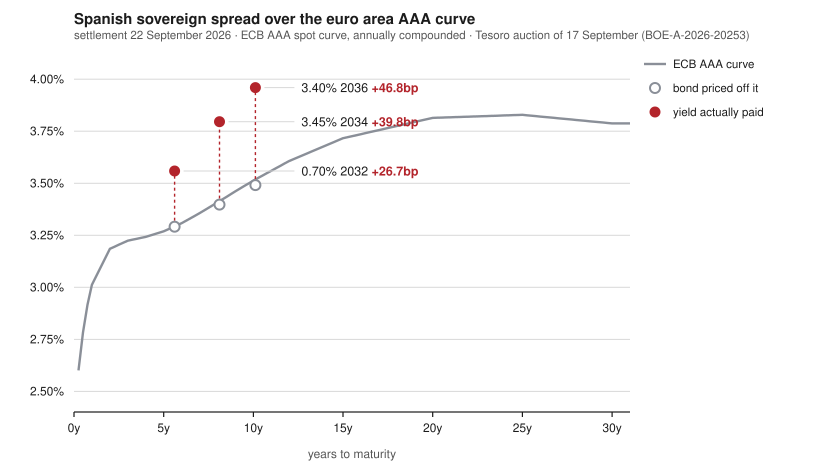

# fixed-income-risk

[](https://github.com/aleexcolleet/fixed-income-risk/actions/workflows/tests.yml)
[](https://www.python.org/)
[](LICENSE)
[](#)

A fixed income valuation and interest rate risk engine in Python, built from
first principles: bonds, then the yield curve, then swaps, then a bucketed
DV01 report for a portfolio.

Every formula is derived, implemented twice — analytically and by numerical
bumping — and asserted to agree. **87 tests, no dependencies beyond pytest.**



## It reproduces numbers somebody else published

Self-consistency tests prove code agrees with itself. They cannot prove it is
right. So the engine is marked against the Spanish Treasury's own published
yields for its auction of 17 September 2026
([BOE-A-2026-20253](https://www.boe.es/diario_boe/txt.php?id=BOE-A-2026-20253)),
settled 22 September:

| bond | model | Treasury | error |
|---|---|---|---|
| Obligación 0.70% 30/04/2032 | 3.5589% | 3.558% | **+0.09bp** |
| Obligación 3.45% 31/10/2034 | 3.7960% | 3.796% | **−0.00bp** |
| Obligación 3.40% 31/10/2036 | 3.9595% | 3.960% | **−0.05bp** |

0.1 basis points is the precision the Treasury prints, so that is as tight as
the comparison can be made.

Discounting the same cashflows off the ECB euro area AAA curve of the same
date gives the Spanish sovereign spread in the chart above. Getting there
required finding a compounding convention hidden in the published data, a
real bug in the cashflow generator that the whole test suite had missed, and
a market time convention that is not a day count.
**[docs/step9-real-data.md](docs/step9-real-data.md)** is the write-up — it is
the most interesting file in the repository.

```bash
python3 scripts/step9_report.py     # reproduces every figure above
python3 scripts/plot_curve.py       # redraws the chart
```

## Ten seconds

```python
from datetime import date

from fitk.bonds import Bond
from fitk.daycount import act_365f

# Obligación del Estado 3.45%, maturing 31 October 2034.
bono = Bond(face=100, coupon=0.0345,
            issue_date=date(2024, 10, 31),
            maturity_date=date(2034, 10, 31),
            frequency=1, daycount=act_365f)

settle = date(2026, 9, 22)

bono.accrued_interest(settle)            # 3.0814   the BOE prints 3.08
bono.street_yield(settle, 97.618)        # 0.037960 the Treasury says 3.796%

bono.dirty_price(settle, 0.03796)        # 100.6811
bono.clean_price(settle, 0.03796)        #  97.5997

bono.modified_duration(settle, 0.03796)  #  6.7270  years
bono.convexity(settle, 0.03796)          # 56.6442
bono.dv01(settle, 0.03796)               #  0.0677  per basis point, per 100 face
```

## The one design decision

**The instrument generates cashflows. The pricing engine discounts them. The
engine does not know which instrument produced them.**

A bond emits a list of `Cashflow(t, amount)`. `price(cashflows, y)` discounts
whatever it is given. A swap will be two cashflow streams with opposite signs,
so adding swaps will require no change to the engine.

`pricing.py` has not changed since step 2, through every sprint that added
coupon frequency, calendar schedules, day count conventions, accrued interest,
yield solving and duration. That is the split paying for itself, and it is the
reason to resist any shortcut that couples an instrument to pricing logic.

## Conventions

- Rates are decimals: `0.04` means 4%.
- The single-yield engine compounds discretely, `m` periods per year
  (`m=1` by default). **The curve in `curve.py` compounds continuously**,
  because that is how the ECB publishes it. The two have separate discount
  functions and an explicit converter; mixing them costs 6bp, which is half a
  point of price on a ten-year bond.
- The engine works in years as a float. Calendar dates live on the
  instrument: a `Bond` holds `issue_date`, `maturity_date` and its own day
  count convention, and converts dates to year fractions before handing
  cashflows over.
- The day count convention is a property of the instrument, not of the engine
  — it is written in the prospectus, like the coupon.
- Coupon schedules are generated **backwards from maturity**, so an off-cycle
  issue date produces a short first coupon, as in the market.
- Amounts are per the instrument's face value.

## Layout

```
fitk/
  cashflows.py  Cashflow(t, amount)
  pricing.py    discount factors, price, dB/dy, yield by Newton-Raphson
  risk.py       duration, convexity, DV01 — analytic and bumped
  curve.py      zero curve, interpolation, continuous discounting, spreads
  bonds.py      Bond: schedule, cashflows, clean/dirty, accrued, street yield
  daycount.py   ACT/360, ACT/365F, 30/360
  schedule.py   month arithmetic, backward schedules, quasi-coupon dates
data/           the ECB curve and the BOE auction, with sources and dates
docs/           what the real data taught, and the chart
scripts/        reproduce every published figure; no matplotlib
tests/          87 tests, mostly property-based
```

## Roadmap

1. ~~Bond pricing from cashflows~~
2. ~~Annual coupons + redemption~~
3. ~~Tests: par identity, monotonicity~~
4. ~~Coupon frequency + calendar schedules~~
5. ~~Day count conventions: ACT/360, ACT/365F, 30/360~~
6. ~~Clean vs dirty price, accrued interest~~
7. ~~Yield solving (Newton-Raphson)~~
8. ~~Duration, modified duration, convexity, DV01~~
9. ~~Real data: ECB curve + Spanish Tesoro bonds~~
10. Curve bootstrapping, forward rates
11. Vanilla interest rate swap, swap rate, swap DV01
12. Bucketed DV01 (key rate durations) for a portfolio

## Not implemented, deliberately

Holiday calendars and business day adjustment, curve bootstrapping, forward
rates, swaps, floating-rate notes, options, inflation-linked bonds,
multi-curve (OIS/IBOR) discounting.

Interpolation on the curve is linear on zero rates with flat extrapolation.
That is the simplest thing that is honest about itself: it produces kinked
forward rates at every node and pretends the curve stops moving past 30
years. Step 10 does better.

`ACT/ACT ICMA` is absent as a day count function. Accrued interest is a ratio
of two day count fractions, and any ACT convention's denominator cancels in
that ratio, so ACT/360, ACT/365F and ACT/ACT ICMA all return the same accrued
figure. The function would be dead code. The ICMA *time measure* is a
different thing and does exist, as `Bond.icma_cashflows`.

### A note on the two spread numbers

The chart shows the spread in yield terms — the same bond's real yield minus
the yield it would have if priced off the AAA curve: 26.7, 39.8 and 46.8bp.
`implied_flat_spread` instead solves for a parallel shift of the continuously
compounded zero curve: 25.5, 38.2 and 44.9bp. Neither is wrong; they are
spreads over different bases, and the gap between them is the compounding
convention again. Quoting one without saying which is how spread numbers stop
being comparable.

## Running the tests

```bash
python3 -m pytest -q
```

## License

MIT
